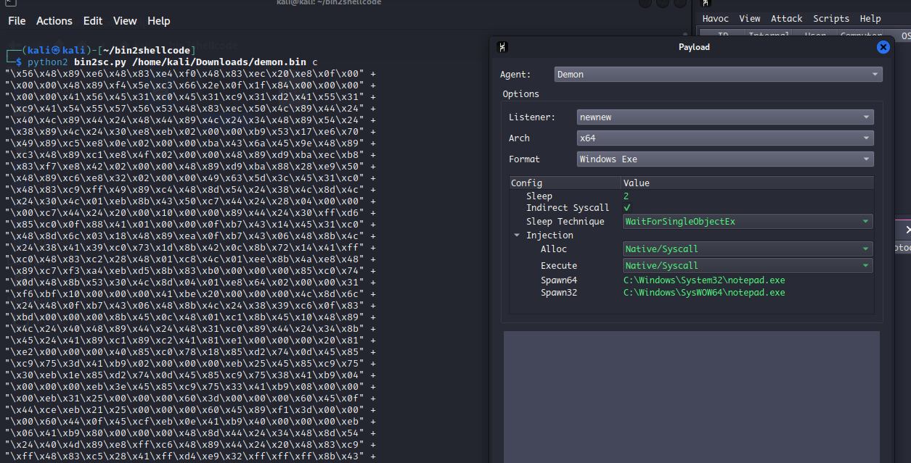

# Convert .bin to c# and c shellcode

Usage:

```
python2 bin2sc.py <file>.bin c|cs
```

Credits :
1.  @superkojiman for his c shellcode conversion.
https://gist.github.com/superkojiman/11164279

Trying to convert bin file that is generated from havoc C2




